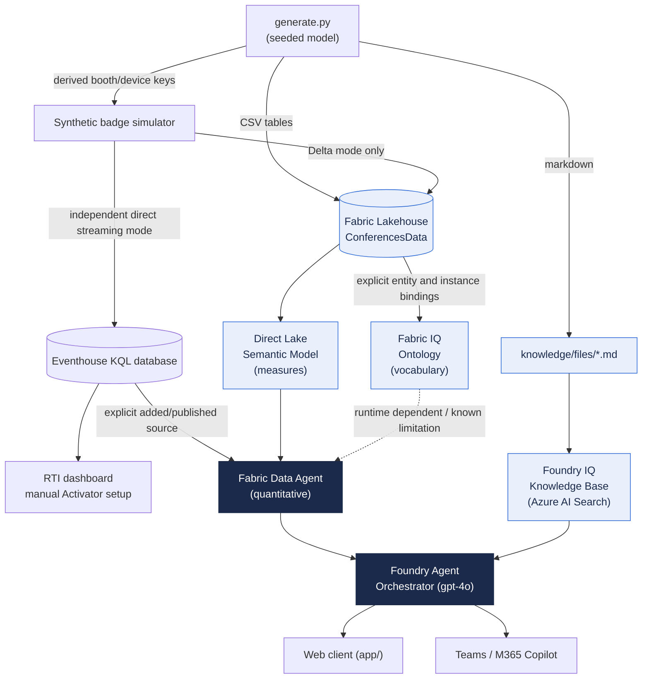

# Architecture

The demo realizes the "Microsoft IQ" pattern: **structured data** and
**unstructured knowledge** behind one agent, each reachable through the tool best
suited to it, with an orchestrator deciding per question.

## Why two sources?

| Question style | Example | Answered by |
|----------------|---------|-------------|
| Quantitative / ranking | "Which speakers had the most licensed users attend?" | **Fabric Data Agent** over the semantic model |
| Qualitative / descriptive | "What sponsorship packages are available?" | **Foundry IQ** knowledge base |
| Blended | "Which speaker drew the most licensed users, and what's their background?" | **Both** — number first, then enrich |
| Live operational | "Which booth went quiet for this run and UTC window?" | Explicitly added **KQL Data Agent source** |

The orchestrator's instructions (see `agent/orchestrator-instructions.md`) encode
these routing rules and require it to name the source it used.

## Data ↔ knowledge consistency

Both the CSV tables and the markdown knowledge are generated from the **same
deterministic model** (`generator/model.py`). That means the top speaker in the
data is the same person profiled in `speaker-directory.md`, and the top sponsor in
the data is the same company highlighted in `sponsor-prospectus.md` — so blended
answers never contradict themselves.

## The two layers of data

1. **Licensed-user model** — the "one question, four answers" story. Four business
   units define a *licensed user* differently, yielding 658 / 749 / 2,294 / 3,484
   across the same 5,000 people. The point: the spread is a governance/definition
   problem, not a data-quality one.
2. **Conference model** — eight conferences, 60 speakers, ~130 sessions, tens of
   thousands of registrations and attendances, 30 sponsors with pipeline/ROI, plus
   feedback and finance. Built on the same 5,000 users, so "licensed users
   attended" ties the two layers together.

See `data/schema.md` for the full table and relationship reference.

## Key implementation notes

- **Data Agent routing.** Historical/Delta quantitative questions resolve from the
  *semantic model*; Eventhouse RTI resolves from an explicitly added *KQL source*,
  not the ontology (which has no measures). The Data Agent instructions
  pin this with a top-priority rule; without it, ranking questions can fail with
  "there's content here I can't work with."
- **Foundry IQ ingestion RBAC.** If API-key auth is disabled on the Foundry
  resource, the Azure AI Search service needs a managed identity with
  **Cognitive Services User** on that resource, or uploads fail with a misleading
  "File upload processing failed."
- **Agent invocation.** The web client calls the agent through the **project**
  Responses API (`{account}/api/projects/{project}/openai/responses`), referencing
  the agent by name. The account-root Azure OpenAI path only accepts model
  deployments, not agents. The caller needs the **Cognitive Services OpenAI User**
  data-plane role (control-plane Owner is not sufficient).

## RTI and grounding boundaries

See `rti/README.md` for schema, finite seeded runs, secure ingestion, half-open UTC
windows, zero-scan dimensions, same-conference/tier peer comparison, stream health
and a one-booth outage. Delta and Eventhouse paths are independent and not
automatically synchronized. Eventstream creation alone is not a wired route;
there is no subsecond guarantee or automatically activated alert.

Ontology relationship types are declarations, not FK-name automatic joins:
`agent/ontology-bindings.json` describes explicit instance mappings still requiring
setup. `agent/metadata-grounding.md` records an isolated ontology-only source probe:
baseline unavailable and persisted `elements[].description` CE-17 rule still
unavailable in the observed Standard runtime. It is **not** a successful grounding
claim, and no reference answers are injected into instructions or knowledge.
